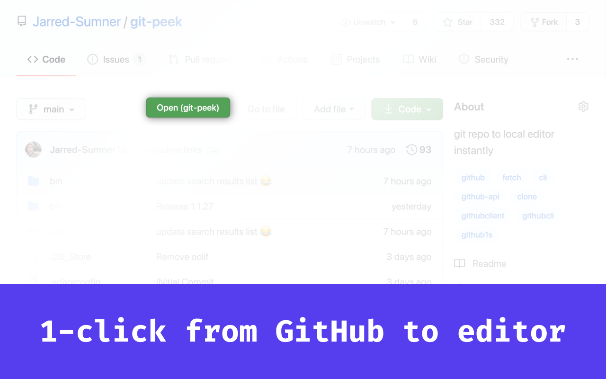
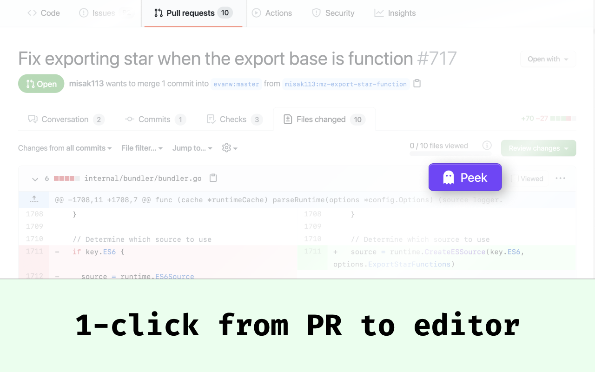
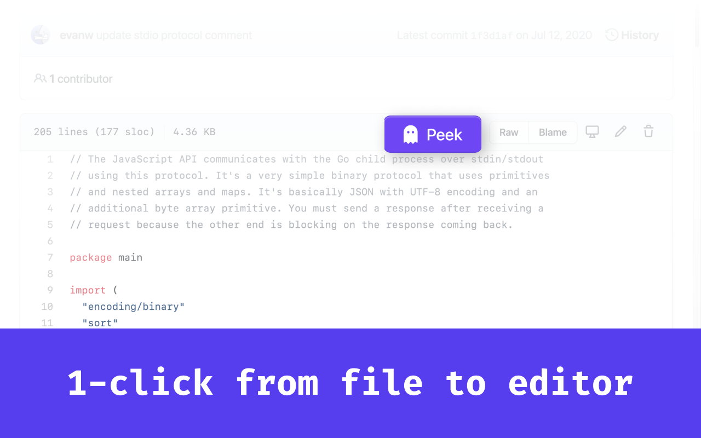

# 1-click from GitHub to local editor

Instantly open files, pull requests, and repositories from GitHub in your local editor. Read, search, and review code from the comfort of your own local editing environment.

`git-peek` stores the files in a temporary directory, and automatically deletes the repository from your computer when you close your editor. [`git-peek`](https://github.com/Jarred-Sumner/git-peek) is also available as a CLI, this is the browser extension.

## Installation

### [Download git-peek for Chrome](https://github.com/Jarred-Sumner/1-click-from-github-to-editor/releases/download/1.0/chrome-extension-git-peek.zip)

Then drag and drop the `.zip` file into `chrome://extensions`

### [Download git-peek for Firefox](https://github.com/Jarred-Sumner/1-click-from-github-to-editor/releases/download/1.0/firefox-addon-git-peek.xpi)

Then just drag and drop the `.xpi` file into Firefox.

Once you install the extension, you will need to ensure `git-peek` is installed and configure your system to open `git-peek` when a `git-peek://` url is opened. Please see [post-installation instructions](POST-INSTALL.md) for more information. (the page should open automatically if you dragged and dropped the extension file to install it)

Supports Visual Studio Code and Sublime Text on macOS. Probably not vim, unless its a GUI version.

Basically all this extension does is add three "Open" buttons to GitHub. These "Open" buttons open `git-peek://github-url-in-here`, which triggers `git-peek` to very quickly fetch the file/branch/repo/pull request and open it in your local editor. All the magic is in `git-peek`. This just adds some buttons so you don't have to paste links into your terminal.
